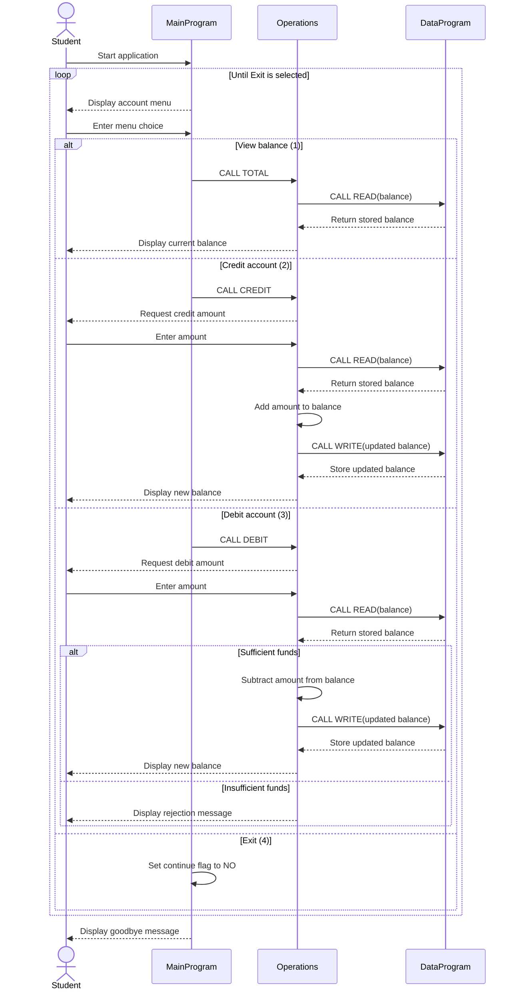

# Student Account COBOL Programs

This directory documents the COBOL account-management example in `src/cobol`.
The program provides a simple interactive interface for viewing and changing a
single student account balance.

## Program Files

### `src/cobol/main.cob`

`MainProgram` is the user-facing entry point. It displays the account menu,
accepts a choice from 1 through 4, and dispatches the selected action to the
`Operations` program.

Key responsibilities:

- Display the account-management menu.
- Accept the user's menu choice.
- Request a balance total, credit, or debit through `Operations`.
- Continue until the user selects Exit.
- Display an error for choices outside 1-4.

### `src/cobol/operations.cob`

`Operations` contains the account transaction logic. It receives an operation
code from `MainProgram`, reads the current balance from `DataProgram`, applies
the requested change, and writes successful changes back to storage.

Key operations:

- `TOTAL `: Read and display the current balance.
- `CREDIT`: Accept an amount, add it to the balance, save the result, and
  display the new balance.
- `DEBIT `: Accept an amount, verify that sufficient funds are available,
  subtract it, save the result, and display the new balance.

The operation codes are six characters wide, so `TOTAL ` and `DEBIT ` include a
trailing space.

### `src/cobol/data.cob`

`DataProgram` provides the balance storage service. It receives an operation
code and a balance through its linkage section:

- `READ`: Copy the stored balance into the caller's balance field.
- `WRITE`: Replace the stored balance with the caller's balance.

The stored balance starts at `1000.00` and remains available while the program
run continues. There is no file or database persistence between runs.

## Student Account Business Rules

- A new program run starts with a balance of `1000.00`.
- A credit increases the balance by the entered amount.
- A debit is allowed only when the current balance is greater than or equal to
  the requested amount.
- A debit that would exceed the balance is rejected and displays
  `Insufficient funds for this debit.` The stored balance is unchanged.
- A successful credit or debit is written back before the new balance is shown.
- The example models one shared account balance. It does not identify students,
  support multiple accounts, or track transaction history.
- Amounts use a COBOL numeric format with two decimal places. The current code
  does not explicitly validate that entered amounts are positive or otherwise
  report malformed input; those are operational limitations to consider before
  using this as a production student-account system.

## Flow

```text
MainProgram
    |
    +--> Operations: TOTAL / CREDIT / DEBIT
              |
              +--> DataProgram: READ balance
              |
              +--> DataProgram: WRITE balance (successful changes only)
```

## Data Flow Sequence


